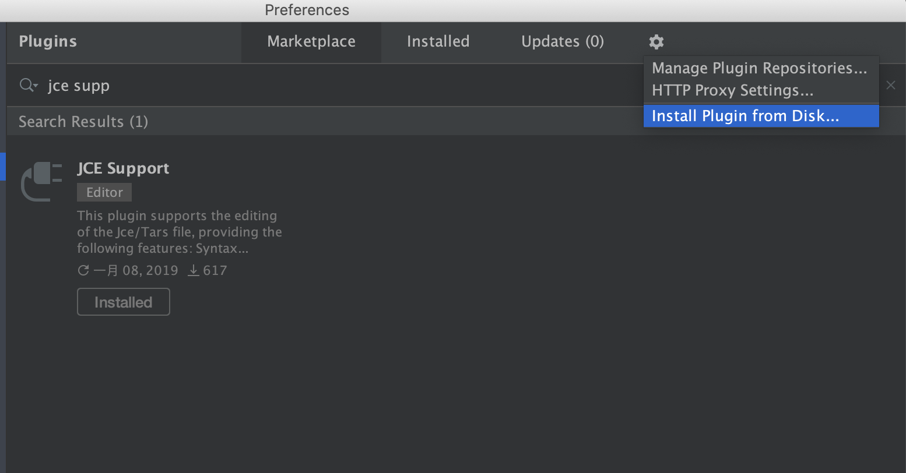
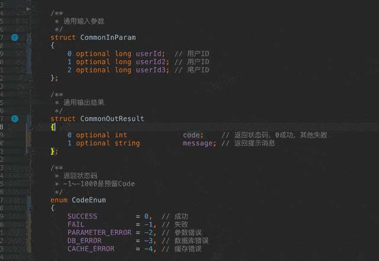

# Jce Language Support

编辑Jce文件的Intellij IDEA插件(支持Intellij IDEA, AndroidStudio, PhpStorm, WebStorm等Intellij IDE)

## 安装说明

### 网络安装

本插件已经在JetBrains Plugin Repository发布，通过IDE的Plugin入口，查找**Jce Support**，可进行在线安装或更新。

### 本地安装

下载本项目的dist文件夹下的[jce-support-0.3.1.jar文件](dist/jce-support-0.3.1.jar), 然后再通过Intellij Idea的设置菜单安装本地插件

> 注意，通过本方法安装的插件，将不会自动更新

## 功能介绍

1. 关键字高亮, 代码折叠，面包屑导航
    
2. 静态分析与自动修复
    
    
3. 点击跳转与查看usage
    
4. 代码格式化与代码风格设置
5. 智能提示module与自定义类型
    
    
6. 自动提示include文件
    
7. 智能重命名
    
8. 自动生成测试用例
    

## Todo

- [x] 支持tars
- [ ] 编译jce

## 维护说明

1. 本项目利用Intellij IDEA开发，请参考Intellij IDEA的[插件开发](http://www.jetbrains.org/intellij/sdk/docs/basics/getting_started.html)
   > 可以使用Intellij IDEA Community Edition来维护本项目的插件
2. src/main/java下的代码为插件所有逻辑, src/main/resources下的代码为插件的资源文件
