1. 关键字高亮, 代码折叠，面包屑导航
    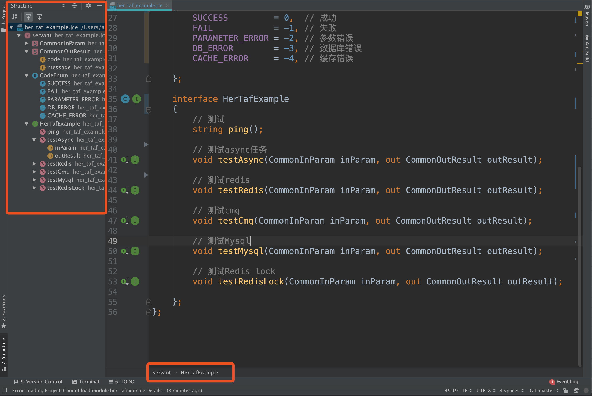
2. 静态分析与自动修复
    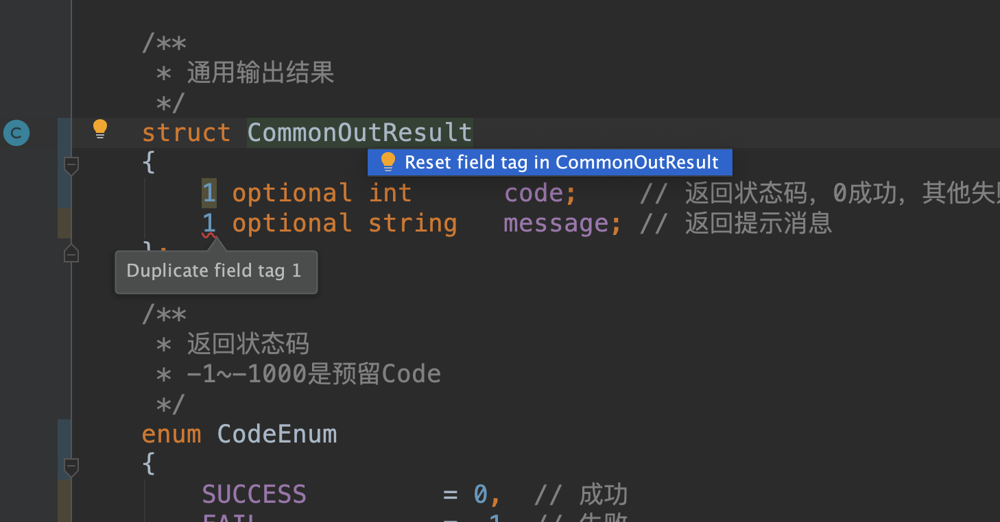
    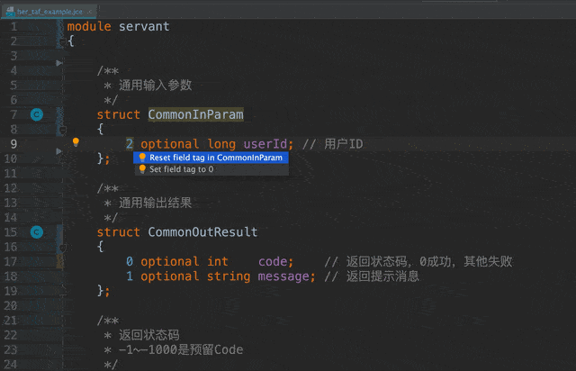
    
3. 点击跳转与查看usage
    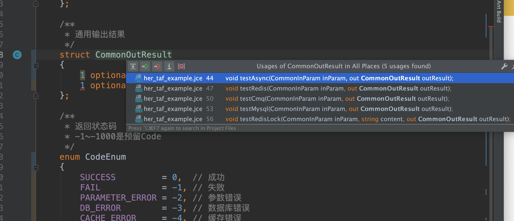
    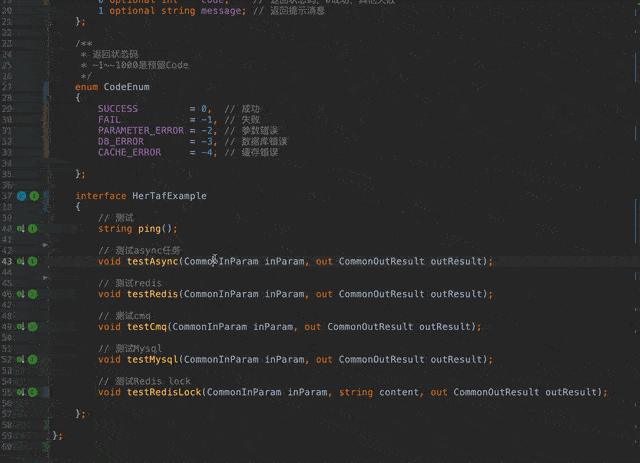
4. 代码格式化与代码风格设置
    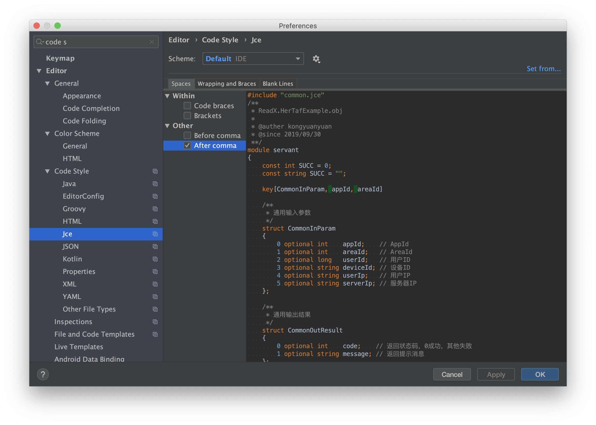
5. 智能提示module与自定义类型
    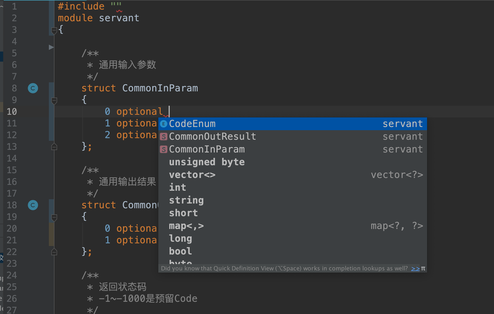
    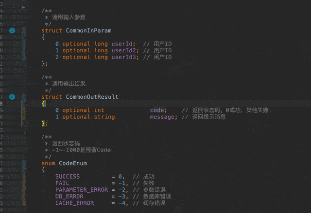
6. 自动提示include文件
    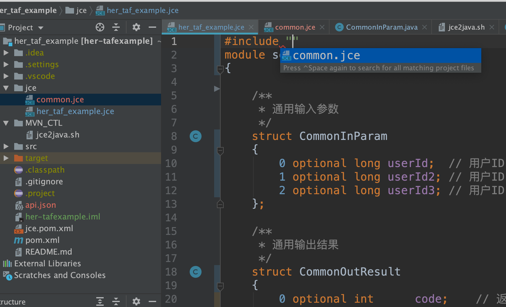
    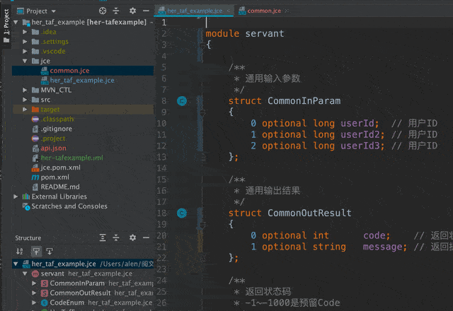
7. 智能重命名
    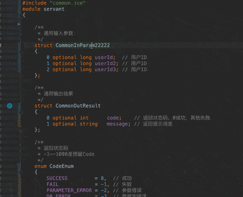
8. 自动生成测试用例
    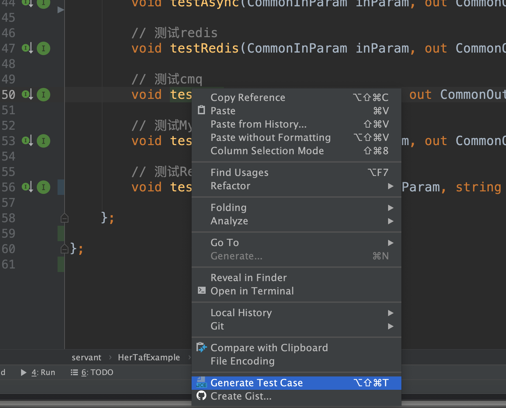
    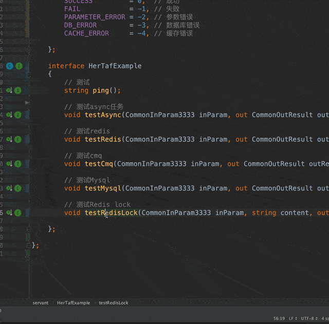
9. java与jce之间相互跳转
    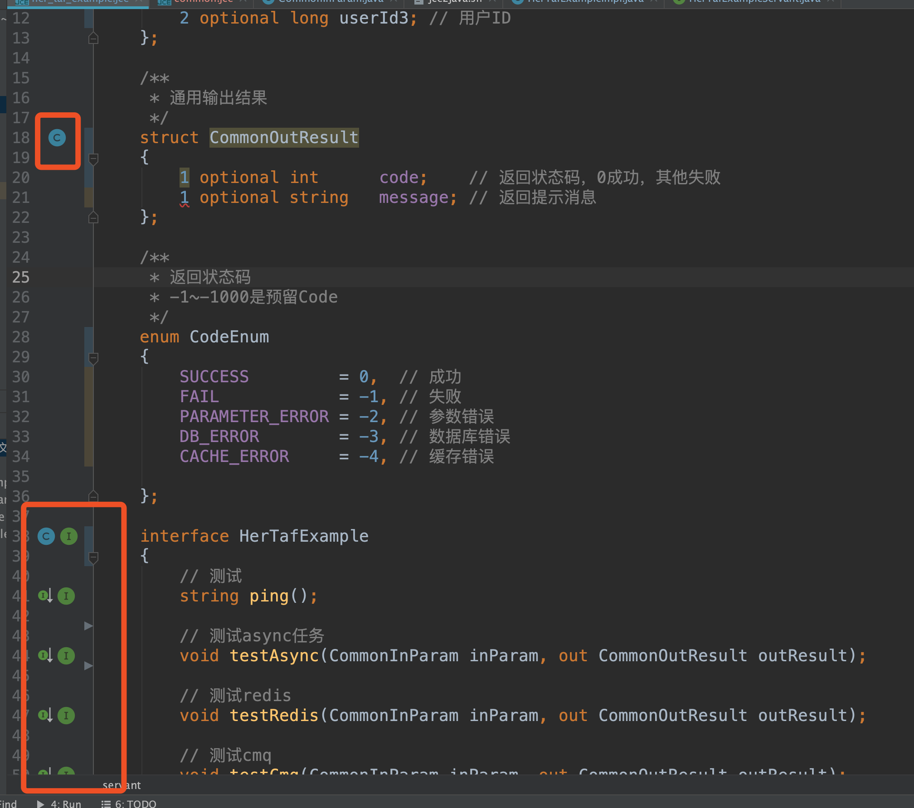
    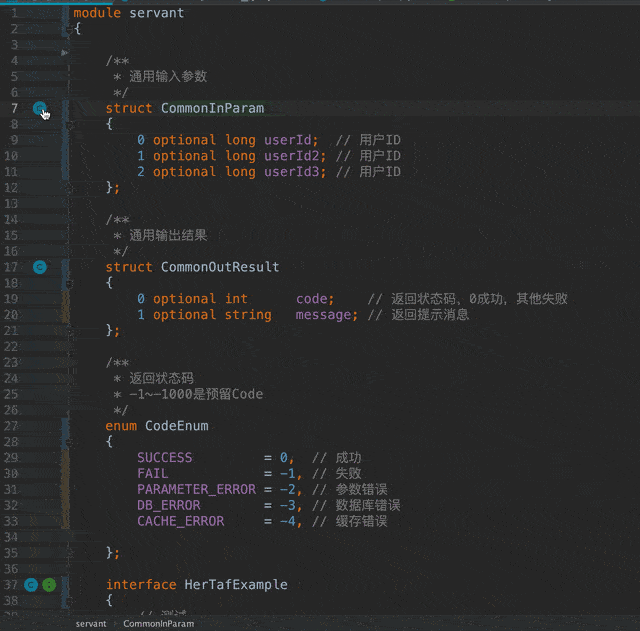